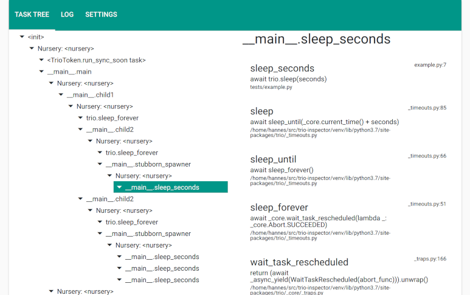

# Trio Inspector

Note: This is a very early prototype.



## Installation

Currently requires Python 3.7 due to ``quart-trio`` dependency.

```
pip install trio-inspector
```

## Usage

```
from trio_inspector import TrioInspector

...

async with trio.open_nursery() as nursery:
    nursery.start_soon(TrioInspector().run)
```

Then, point your browser to: http://127.0.0.1:5000/

If you want to try it out, you can download and run [this example](tests/example.py).
